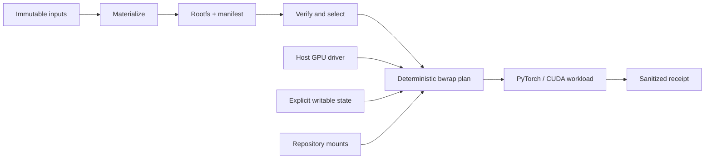

# Vaso

**A Bubblewrap-native rootfs contract for reproducible PyTorch and GPU-ML
development.**

Vaso is defining and implementing a Linux filesystem boundary for ML
repositories that need CUDA toolchains, native extension builds, distributed
launchers, coding agents, and multi-repository source trees. A Vaso environment
is a materialized root filesystem entered with unprivileged
[Bubblewrap](https://github.com/containers/bubblewrap), not a long-running
container or a Docker-dependent runtime.

> [!IMPORTANT]
> Vaso is an early reference implementation. Repo-local host-layout preflight
> works today. Rootfs materialization, bwrap execution, the public conformance
> suite, and B200 qualification are not implemented yet. The current tree is
> not a production security boundary or a production-qualified release.

## Why Vaso

PyTorch development crosses boundaries that ordinary application sandboxes
rarely need to handle together:

- Python environments, PyTorch wheels, and compiled C++/CUDA custom operators;
- host GPU devices, driver libraries, and `torchrun`/NCCL distributed jobs;
- writable package, build, TorchInductor, Triton, dataset, and model caches;
- durable checkpoints and experiment outputs alongside disposable scratch;
- several source repositories participating in one build or training run; and
- enough evidence to reproduce which rootfs, mounts, environment, and command
  produced a result.

Vaso makes those boundaries explicit. The target contract combines an
immutable rootfs with narrowly declared writable surfaces, a cleared and
allowlisted environment, deterministic bwrap plans, and sanitized run receipts.
Docker or BuildKit may be used to *materialize* a filesystem; normal builds,
tests, and ML workloads run through bwrap without a Docker daemon.

## Quick start: inspect the current scaffold

Vaso requires Python 3.11 or newer and currently has no runtime Python
dependencies. From a clean checkout:

```bash
git clone https://github.com/phi9t/vaso.git
cd vaso
PYTHONPATH=src python -m vaso.cli --help
PYTHONPATH=src python -m vaso.cli validate --tier 0
```

The current `--tier 0` command is an early host-layout preflight. It creates the
ignored, repo-local `.vaso/` layout, verifies its required host backing
directories are writable, and writes a timestamped evidence bundle under
`.vaso/runs/`:

```text
.vaso/runs/<run-id>/
├── bwrap-plan.json
├── result.json
├── stderr.log
├── stdout.log
└── validation/
    └── tier0.json
```

This preflight does **not** satisfy the v1 Tier 0 contract described in the
design, which requires entering bwrap and validating the boundary from inside
the sandbox.

Check whether the host has Bubblewrap and a usable materialized rootfs with:

```bash
PYTHONPATH=src python -m vaso.cli doctor
```

`doctor` exits non-zero until both prerequisites exist. The current
`validate --tier 1` command is also a placeholder that intentionally exits
non-zero; it does not yet enter a rootfs or execute a GPU workload.

## Reference lifecycle



The diagram describes the Vaso v1 lifecycle. The repository currently
implements the planning, host-layout preflight, and run-record foundations of
that lifecycle.

| Capability | Current state |
| --- | --- |
| Repo-local host layout under `.vaso/` | Implemented |
| Deterministic mount and bwrap argument planning | Implemented |
| Host backing-directory writability preflight | Implemented |
| Plans, logs, results, and validation records | Implemented |
| Pinned rootfs materialization and verified selection | Planned for v1 |
| Execution inside unprivileged bwrap | Planned for v1 |
| Standalone downstream conformance suite | Planned for v1 |
| PyTorch/CUDA execution qualified on NVIDIA B200 | Planned release gate |

## Target filesystem contract

The v1 design gives each class of state a stable place inside the sandbox:

```text
/workspace/<repo>   mounted source repositories (read-only unless declared rw)
/home/kvothe        normal user home for tools that require HOME
/vaso/cache         package, build, kernel, and tool caches
/vaso/state         durable Vaso-owned state
/vaso/runs          per-run plans, logs, results, and validation evidence
/vaso/traces        cross-run agent and trajectory records
/opt/vaso           immutable toolchains and rootfs contract metadata
/run/nvidia-driver  projected host NVIDIA driver libraries and tools
/tmp                process-local temporary storage
```

The rootfs is read-only during normal execution. Every writable bind is listed
individually in the plan; making a parent such as `/vaso` or `/workspace`
implicitly writable is outside the contract. Host repositories appear only at
declared `/workspace/<repo>` paths.

The complete target contract—including environment handling, mount ordering,
GPU projection, Bazel behavior, run records, and failure modes—is in the
[rootfs infrastructure design](docs/rootfs-container-infra-design.md).

## PyTorch and ML use cases

Vaso is designed as a foundation for repository-specific environments, not as
a universal prebuilt ML image. The v1 contract is being shaped around these
cases:

- developing and testing PyTorch training code against pinned Python, PyTorch,
  CUDA, compiler, and native-library inputs;
- building custom C++ and CUDA extensions without leaking undeclared host
  headers, libraries, or package state into the result;
- running single-node and `torchrun`/NCCL distributed B200 workloads with
  explicit GPU, driver, network, and topology declarations;
- isolating package, TorchInductor, Triton, and build caches from durable model
  weights, datasets, checkpoints, logs, and experiment evidence;
- mounting framework, kernel, model, and orchestration repositories together
  while preserving a stable path for each; and
- running coding agents inside the same filesystem contract used to build and
  test their changes.

These are target design cases, not claims that the current implementation has
already qualified them. NVIDIA B200 is the first planned GPU qualification
profile.

## Planned v1 portability contract

Vaso is intended to publish both a specification and its executable reference.
Once v1 is frozen, a downstream ML repository should implement its own
self-contained rootfs support:

1. Pin a released Vaso specification version and digest once v1 is frozen.
2. Define repository-specific immutable toolchain and rootfs inputs.
3. Preserve the Vaso filesystem, environment, planning, and receipt contracts
   while adding only the writable surfaces the workload needs.
4. Keep materialization, launchers, profiles, tests, and evidence inside that
   repository.
5. Pass the public conformance suite and a repository-specific accelerator
   qualification gate before claiming production readiness.

Under that contract, the resulting implementation imports no Vaso package,
calls no Vaso service, and requires no Vaso checkout at build or runtime.
Compatibility is behavioral: the repository follows the versioned contract
and proves that with conformance evidence. No released specification or public
conformance suite exists yet.

## Security model

The v1 design uses positive declarations instead of ambient host access:

- the rootfs and toolchain inputs are pinned and verified before selection;
- bwrap starts from a cleared environment and restores an explicit allowlist;
- source, state, cache, data, and credential access are separate declarations;
- secrets are opt-in and receipts record their redacted names, never values;
- network mode is part of the plan rather than an invisible host default; and
- plans and receipts bind execution evidence to rootfs and command identity.

These properties describe the target contract. Until materialization,
execution, negative conformance tests, and B200 qualification are complete,
Vaso must not be treated as an enforced isolation boundary.

## Development

Install `pytest`, then run the test suite with:

```bash
python -m pytest -q -p no:cacheprovider
```

Useful references:

- [Rootfs infrastructure design](docs/rootfs-container-infra-design.md)
- [GPU wheel research](docs/research/astral-gpu-wheels.md)
- [Agent instructions](AGENTS.md)
- [Agentic engineering workflow](docs/agents/agentic-engineering.md)

Before changing code, read `AGENTS.md` and the repository guidance it points
to. Keep generated rootfs state and run evidence under the ignored `.vaso/`
directory.

## License

Vaso is available under the [MIT License](LICENSE).
